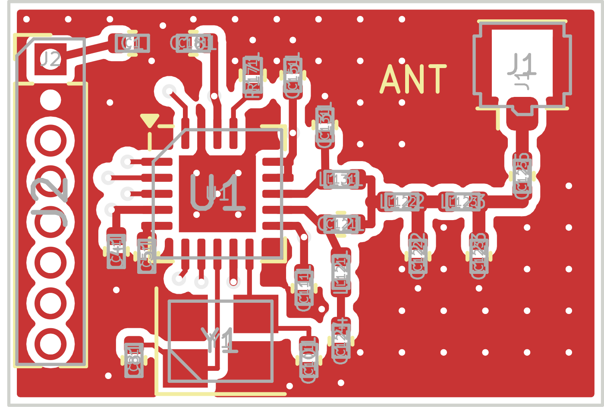
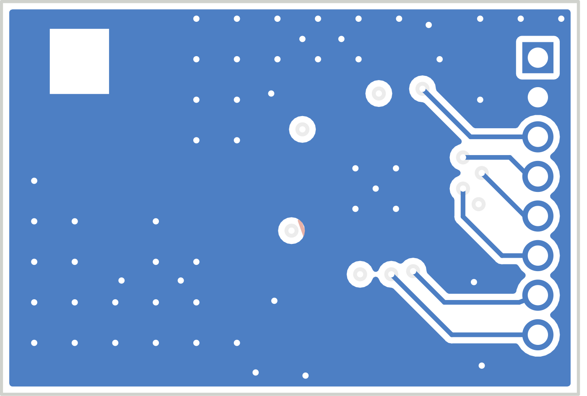

# cc1101-mini: an 18.5 x 12.6 mm TI CC1101 433 MHz module

A tiny, placed-and-routed 4-layer PCB for the TI CC1101 sub-1 GHz transceiver.
It uses TI's 433 MHz reference RF front end (SWRS061I Figure 10 / Table 21),
has a U.FL antenna port, and brings SPI + GDO0/GDO2 + power out to a 1x8,
1.27 mm header. It passes KiCad DRC with 0 errors and 0 unconnected pads.

| Top | Bottom (viewed from below) |
|---|---|
|  |  |

## At a glance

| | |
|---|---|
| Size | 18.5 x 12.6 x 1.6 mm (plus J1 1.25 mm and optional header) |
| Radio | CC1101RGPR, 433 MHz band, up to +10 dBm, -116 dBm sensitivity (0.6 kBaud) |
| Supply | 1.8-3.6 V from the host, ~29 mA TX @ +10 dBm, ~16 mA RX, 0.2 uA sleep |
| Interface | SPI (10 MHz max) + GDO0 + GDO2 |
| Antenna | U.FL, 50 ohm |
| Parts | 23 (19 x 0402, QFN-20, 3225 crystal, U.FL, header), all SMT on the top except J2 |
| Stackup | 4-layer 1.6 mm (JLC04161H-7628), 0.2/0.45 mm vias, 0.15 mm tracks |

### Header J2 (pin 1 = square pad, marked "1" on the bottom)

| 1 | 2 | 3 | 4 | 5 | 6 | 7 | 8 |
|---|---|---|---|---|---|---|---|
| 3V3 | GND | MOSI | SCK | MISO | GDO2 | GDO0 | CSn |

## Files

| File | What it is |
|---|---|
| `spec.md` | Board requirements (the pcba-builder spec format) |
| `bom.csv` | Bill of materials with MPNs (pcba-builder BOM format) |
| `netlist.md` | Every net and pin, extracted from the routed board |
| `schematic_blocks.md` | Schematic by functional block, with values and sketches |
| `design_notes.md` | Stackup, layout rationale, 50 ohm calc, DRC results, design decisions |
| `assembly_instructions.md` | Paste/reflow profile, inspection, power-on and SPI bring-up |
| `pcb/cc1101_mini.kicad_pcb` | The routed KiCad 7 board (open with `cc1101_mini.kicad_pro`) |
| `pcb/gen_board.py` | Generates the board: placement, routing, zones, stitching, as code |
| `pcb/make_fab.sh` | Regenerates the board and every fab output below |
| `pcb/drc_report.txt` | KiCad DRC report |
| `pcb/fab/cc1101_mini-gerbers.zip` | Gerbers + Excellon drills, ready to upload to a fab |
| `pcb/fab/cc1101_mini-pos.csv`, `...-cpl-jlc.csv` | Pick-and-place (KiCad and JLCPCB formats) |
| `cc1101-mini.glb` | 3D box preview (pcba-builder's glTF writer, real placement) |

## Ordering

1. Upload `pcb/fab/cc1101_mini-gerbers.zip`: 4 layers, 1.6 mm, ENIG, and a
   0.2 mm min hole. Pick the JLC04161H-7628 stackup (or tell your fab the RF
   trace is 0.40 mm CPWG with a 0.25 mm gap and should be ~50 ohm).
2. For assembly, upload `bom.csv` (map the MPNs to the assembler's part
   numbers) and `pcb/fab/cc1101_mini-cpl-jlc.csv`. **Check rotations in the
   placement preview**, especially U1, Y1 and J1.
3. Read the checklist in `design_notes.md` ("Before ordering").

## Regenerating

Needs KiCad 7 (`pcbnew` Python module + `kicad-cli`) and the stock footprint
libraries, e.g. on Ubuntu 24.04: `apt install kicad kicad-footprints librsvg2-bin`.

```
cd boards/cc1101-mini/pcb
./make_fab.sh
```

To change the layout, edit the `PARTS` table or the `track()`/`via()` calls
in `gen_board.py`, rerun, and check DRC (or just open the `.kicad_pro` in
KiCad and edit by hand; the script is only a starting point).

## Limitations

- **433 MHz only** (315 MHz is a BOM-only change); 868/915 MHz needs the
  other balun topology and a re-layout. See `design_notes.md`.
- No `.kicad_sch` schematic; connectivity lives in the PCB and `netlist.md`.
- Not built or RF-tested yet. The RF values are TI's reference values, but
  the layout is not TI's reference layout, so the match may need touch-up
  with a VNA for best output power and harmonics.
- Not certified. Radiated use must meet local rules (FCC 15.231,
  ETSI EN 300 220, ...).
