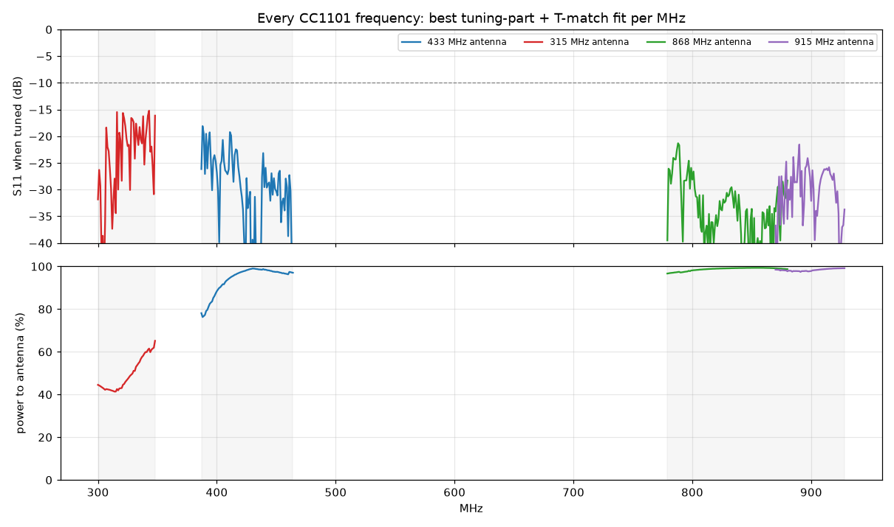

# nano-every-cc1101: Arduino Nano Every + 2x CC1101, every sub-GHz band

A 100 x 100 mm **2-layer** carrier board for an Arduino Nano Every with two
TI CC1101 radios, so every frequency the CC1101 supports (300-348, 387-464
and 779-928 MHz) is covered. Four printed antennas, each tunable across its
range with 0603 parts (values per MHz from a full-wave openEMS model), plus
an SMA jack and a wire-whip hole per radio.
The Gerbers are generated and pass KiCad DRC with 0 errors and 0 unconnected pads.

| Top | Bottom (viewed from below) |
|---|---|
|  |  |

## What's on it

| | |
|---|---|
| Board | 100 x 100 x 1.6 mm, 2 layers, FR4 |
| Radio A (U1) | CC1101, 315/433 MHz front end (433 fitted) |
| Radio B (U501) | CC1101, 868/915 MHz front end |
| Antennas | 4 printed, tunable across 300-348 / 387-464 / 779-928 MHz; SMA J1/J2; wire holes H1/H2 |
| Host | Arduino Nano Every in sockets, USB at the board edge, every pin re-broken-out on J3/J4 |
| Glue | TXS0108E 5 V <-> 3.3 V level shifter, AP2112K 3.3 V LDO, power LED |

**Every CC1101 frequency is covered by a printed antenna.** Each antenna
has a tuning part in its arm and a T-match at its feed, and
[`antenna/results/tuning.md`](antenna/results/tuning.md) gives the parts for
every MHz (simulated with openEMS, full board, all four antennas present):

| CC1101 band | Antenna | Worst S11 when tuned | Power reaching the antenna | Default fit (-10 dB) |
|---|---|---|---|---|
| 300-348 MHz | 315 (radio A, 315 MHz BOM) | -15.2 dB | 41-65 % | 313.7-316.3 MHz |
| 387-464 MHz | 433 (radio A) | -18.1 dB | 76-99 % | 431.3-436.5 MHz |
| 779-880 MHz | 868 (radio B) | -21.3 dB | 97-99 % | 843-883 MHz |
| 870-928 MHz | 915 (radio B) | -21.6 dB | 97-99 % | 902-1044 MHz |

The SMA jacks and wire holes add an external whip at any frequency
(L = 71 250 / f mm, table in `tuning.md`).

## Choosing the antenna

Fit **one** selector per radio; the board ships set up for 433.92 MHz
(radio A) and 868.3 MHz (radio B):

| Radio | 433 MHz PCB | 315 MHz PCB | 868 MHz PCB | 915 MHz PCB | SMA / wire |
|---|---|---|---|---|---|
| A | **R301** (default) | R311 + 315 MHz BOM | | | R403 0R |
| B | | | **R321** (default) | R331 | R406 0R |

For another frequency, fit the row for it from `antenna/results/tuning.md`
(tuning part L40x, selector R3x1, shunt C3x1, series L3x1).
`assembly_instructions.md` has the 315 MHz front-end BOM swap.

## Pins (Nano Every)

SPI shared: D13 SCK, D11 MOSI, D12 MISO. Radio A: CSn D10, GDO0 D2, GDO2 D3.
Radio B: CSn D9, GDO0 D4, GDO2 on test pad TP1 (3.3 V).
With RadioLib, e.g. `CC1101 radioA = new Module(10, 2, RADIOLIB_NC, 3);`
and `CC1101 radioB = new Module(9, 4, RADIOLIB_NC);`.

## Ordering (print ready)

1. PCB: upload `pcb/fab/nano_every_cc1101-gerbers.zip`. 2 layers, 1.6 mm,
   100 x 100 mm, 1 oz. All standard rules (0.15 mm track/space, 0.25 mm
   minimum drill), no special options.
2. Assembly (optional): `pcb/fab/bom-jlcpcb.csv` + `pcb/fab/cpl-jlcpcb.csv`
   (fitted parts only; check the rotations in the preview). Every line has
   an in-stock LCSC number (checked 2026-09-25; out-of-stock design parts
   were swapped for same-value/package C0G/NP0 equivalents, see `JLC` in
   `pcb/fab_outputs.py`), including the SMA jacks J1/J2 (BAT WIRELESS
   BWSMA-KE-P001, C496550, edge mount) and the J3/J4 1x15 headers
   (C7501269, through-hole assembly).
3. By hand: Nano sockets (2x 1x15 female).

## Files

| Path | What |
|---|---|
| `pcb/nano_every_cc1101.kicad_pcb` / `.kicad_pro` | The routed KiCad 7 board |
| `pcb/gen_board.py` | Generates the whole board (placement, RF routing, antennas, autorouting, pours) |
| `pcb/fab_outputs.py`, `pcb/make_fab.sh` | DRC, netlist, BOMs, CPL, Gerbers, renders |
| `pcb/fab/nano_every_cc1101-fab-package.zip` | Everything to order: Gerber zip + both BOMs + CPL |
| `pcb/fab/bom-no-nano.csv` | Purchasing BOM: every part except the Nano Every (MPNs and LCSC numbers, all JLCPCB-stocked) |
| `pcb/fab/` | Gerbers + drills (zip), JLCPCB assembly BOM + CPL |
| `pcb/drc_report.txt` | KiCad DRC report |
| `antenna/` | Antenna geometry, openEMS model, match designer, results |
| `bom.csv`, `netlist.md` | Generated from the board |
| `schematic_blocks.md`, `design_notes.md`, `assembly_instructions.md` | Design docs, bring-up |

## Limits

- Designed and simulated, not yet built or measured. Check each antenna
  with a nanoVNA once built; the T-match pads and the 2 mm trim marks on
  each antenna's open end are there to retune.
- 300-348 MHz from a 100 mm board is electrically small: it works (41-65 %
  of the power reaches the antenna), but the SMA/whip option gives more range.
- A tuned setting is narrowband; changing frequency means changing the
  parts on that table row.
- No `.kicad_sch` schematic; the netlist is generated from the board.
- Not certified. Radiated use must follow your region's rules.
