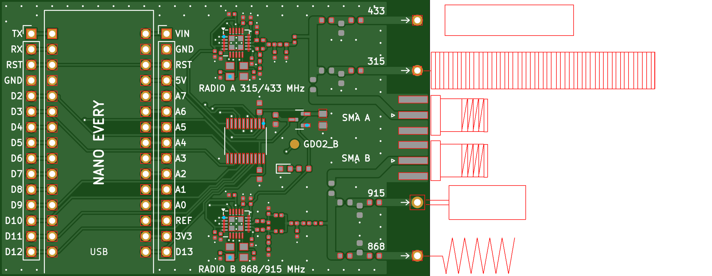

# nano-every-cc1101: Arduino Nano Every + 2x CC1101, coil antennas

A compact 70 x 45 mm **2-layer** carrier board for an Arduino Nano Every
with two TI CC1101 radios covering the CC1101's bands (300-348, 387-464
and 779-928 MHz). Each band has its own **coil (helical spring) antenna**,
the kind used in handheld sub-GHz gadgets, so the board no longer needs
room for large printed antennas. All four coils are JLCPCB-assembled; one
0 ohm selector per radio picks the band. The coils are the bent-leg type:
they lie in the board plane and stick out past the right-hand edge, which
is how their makers build them to be mounted.
The Gerbers are generated and pass KiCad DRC with **0 violations, 0
unconnected pads**.

| Top | Bottom (viewed from below) |
|---|---|
|  |  |

## What's on it

| | |
|---|---|
| Board | 70 x 45 x 1.6 mm, 2 layers, FR4 |
| Radio A (U1) | CC1101, 315/433 MHz front end (433 fitted) |
| Radio B (U501) | CC1101, 868/915 MHz front end |
| Antennas | 4 coil antennas AE1-AE4 (433, 315, 868, 915 MHz), each with a T-match for retuning; SMA J1/J2 |
| Host | Arduino Nano Every (ABX00028 + headers, or ABX00033) in sockets S1/S2, USB at the board edge, every pin re-broken-out on J3/J4 |
| Glue | TXS0108E 5 V <-> 3.3 V level shifter, XC6206 3.3 V LDO, power LED |

## Antennas

| Coil | Band | Radio | Part | LCSC | Maker's VSWR at the band centre | Selected as shipped |
|---|---|---|---|---|---|---|
| AE1 | 433 MHz | A | BAT WIRELESS BW433SNX21-5W2 (5 x 21 mm) | C496554 | 1.32 | **yes** (R301 0R) |
| AE2 | 315 MHz | A | BAT WIRELESS BW315SNX39-6W3 (5.45 x 39 mm) | C496553 | 2.49 | fit R311, remove R301, + 315 MHz BOM |
| AE3 | 868 MHz | B | Vollgo VG868SNX18-5W2 (6 x 18 mm) | C718843 | 1.32 | **yes** (R321 0R) |
| AE4 | 915 MHz | B | Vollgo VG915SNX17-5W2 (5 x 17 mm) | C718842 | 1.56 | fit R331, remove R321 |
| J1 / J2 | any | A / B | SMA edge jack (assembled) | C496550 | - | fit R403 / R406 |

Radio B's coils are Vollgo parts because the BAT WIRELESS 868 MHz coil
measures VSWR 5.3 in its own datasheet (half the power reflected) and the
915 MHz one 2.6.

Each radio has a short 50 ohm bus; every antenna branch starts with its own
selector right at the bus (so unused branches are only a few mm of line),
then a shunt pad (C3x1) and a series part (L3x1, 0 ohm) at the coil for
retuning with a nanoVNA. The coils are pre-tuned by the maker for their
band; they are not simulated on this board. Frequencies between the coil
bands need a retune of that branch's T-match, or an external antenna on the
SMA jack (quarter-wave whip L = 71 250 / f mm).

Each coil's leg goes through a hole 2 mm from the right edge (1.0 mm for the
0.5 mm wire of the BAT WIRELESS coils, 1.1 mm for the 0.75-0.8 mm Vollgo
wire) and the coil lies in the board's plane beyond the edge, pointing away
from the board: the makers' drawings and JLCPCB's 3D models show exactly
this (the coil is thicker than the board, so it cannot lie on top of it).
Past the edge the 433 MHz coil reaches ~24 mm, the 315 MHz up to ~41 mm,
the 868 MHz ~15 mm and the 915 MHz ~17 mm, so leave room for them in an
enclosure. The 315 MHz coil passes 1.3 mm from the SMA J1 body. All four are
fitted, so the unused coil next to the active one detunes it a little (most
for 868 vs 915, which are close in frequency): check with a nanoVNA and
trim the T-match if you need the last dB.

## Pins (Nano Every)

SPI shared: D13 SCK, D11 MOSI, D12 MISO. Radio A: CSn D10, GDO0 D2, GDO2 D3.
Radio B: CSn D9, GDO0 D4, GDO2 on test pad TP1 (3.3 V).
With RadioLib, e.g. `CC1101 radioA = new Module(10, 2, RADIOLIB_NC, 3);`
and `CC1101 radioB = new Module(9, 4, RADIOLIB_NC);`.

## Firmware

`firmware/dual_cc1101/dual_cc1101.ino` runs both radios at once with
RadioLib (receive on both by interrupt, send / retune from the serial
monitor). Compiled for the Nano Every (arduino:megaavr 1.8.8, RadioLib
7.7.1): **25.7 KB of 48 KB flash (52 %), 1.3 KB of 6 KB RAM (20 %)**, so
there is about 23 KB of flash and 4.8 KB of RAM left for your own code.
The receivers use a 135 kHz filter so two boards' +/-10 ppm crystals
always land inside it (58 kHz gives ~3 dB more range between calibrated
boards).

## Verification

Everything was checked before release (`verify/VERIFICATION.md`, re-run
with `verify/run_all.sh`): DRC 0/0; the netlist rebuilt from the Gerber and
drill files alone (all 73 nets, 0 shorts, 0 opens) with JLCPCB's copper,
drill, annular-ring, solder-mask and paste limits measured on those files;
every pair of parts against JLCPCB's SMD spacing table; every IC pin
against the vendor pin names and the Nano against the ABX00028 datasheet;
every firmware pin traced through the level shifter to its CC1101 pin; the
CPL fitted part by part onto JLCPCB's own footprints (66/66 match,
including which way each coil points); every BOM line against its live
LCSC record (value, package, part number) and stock; the coil, header and
socket holes against the makers' drawings; a 2-D field solver for the
50 ohm lines (49.7-51.4 ohm); a simulation of each antenna feed from the
routed copper (S11 -19 to -35 dB, 97-99 % of the power reaching the coil);
the CC1101 harmonic filters; the power budget.

## Ordering (print ready)

1. PCB: upload `pcb/fab/nano_every_cc1101-gerbers.zip` (**not** the
   fab-package zip, which bundles the Gerber zip with the BOM/CPL and is
   for your records). 8 layers with Protel extensions (.GTL .GBL .GTS .GBS
   .GTP .GTO .GBO .GM1) + one plated drill file. 2 layers, 1.6 mm,
   70 x 45 mm, 1 oz. All standard rules (0.15 mm track/space, 0.25 mm
   minimum drill), no special options.
2. Assembly: `pcb/fab/bom-jlcpcb.csv` + `pcb/fab/cpl-jlcpcb.csv` (top side).
   **Everything except the Nano Every is assembled**: all SMD parts, the
   four coil antennas, the SMA jacks J1/J2, the J3/J4 breakout headers and
   the two 1x15 Nano sockets S1/S2 (Megastar ZX-PM2.54-1-15PY, LCSC
   C7499333, soldered into the Nano's holes). Choose **Economic PCBA**
   (Standard PCBA needs boards of 70 x 70 mm or more); it takes the
   through-hole coils, headers and sockets and needs no rails or fiducials.
   The CPL carries JLCPCB's own footprint angles (checked part by part,
   see `verify/VERIFICATION.md`), so the placement preview should show every
   part on its pads without changes, and the SMA jacks and all four coils
   pointing off the right edge. Suggested PCBA remark: *"AE1-AE4 are bent-leg spring antennas: leg through the hole, coil lying flat beyond the right board edge, as in the 3D preview. J1/J2 (SMA edge jacks): please also solder the two bottom-side ground legs."* If JLCPCB does not solder the
   SMA bottom legs (the part is reflowed from the top), solder those four
   joints yourself before using a jack.
3. The Nano Every ABX00028 comes with its two 1x15 headers **loose** in the
   box; solder them on first. Easiest way to get them straight: push the
   headers (long pins down) into S1/S2 on this board, lay the Nano on top,
   solder the 30 pins on the Nano, then pull it out. Plug it into S1/S2 with
   USB toward the board edge (D12/D13 end at the edge). ABX00033 is the same
   Nano with the headers already soldered. Checked against the ABX00028
   datasheet: 2 x 15 pins, 2.54 mm pitch, rows 15.24 mm apart, 43.18 x
   17.78 mm, same pin order.

## Files

| Path | What |
|---|---|
| `pcb/nano_every_cc1101.kicad_pcb` / `.kicad_pro` / `.kicad_dru` | The routed KiCad 7 board (+ the one custom DRC rule) |
| `pcb/gen_board.py` | Generates the whole board (placement, RF routing, autorouting, pours, silkscreen) |
| `pcb/lib/nano_every_cc1101.pretty` | Coil antenna (edge-overhang) and SMA footprints |
| `pcb/fab_outputs.py`, `pcb/make_fab.sh` | DRC, netlist, BOMs, CPL, Gerbers, renders |
| `pcb/fab/nano_every_cc1101-fab-package.zip` | Everything to order: Gerber zip + both BOMs + CPL |
| `pcb/fab/bom-no-nano.csv` | Purchasing BOM: every part except the Nano Every |
| `pcb/drc_report.txt` | KiCad DRC report |
| `firmware/dual_cc1101/` | Example sketch: both radios with RadioLib |
| `verify/` | Pre-order checks and simulations (`run_all.sh`, `VERIFICATION.md`, results, previews) |
| `antenna/` | v1 printed-antenna study (openEMS), kept for reference |
| `bom.csv`, `netlist.md` | Generated from the board |
| `schematic_blocks.md`, `design_notes.md`, `assembly_instructions.md` | Design docs, bring-up |

## Limits

- Designed, not yet built or measured. Check each coil with a nanoVNA once
  built; the T-match pads are there to retune.
- The coils stick out past the right edge (up to ~41 mm for the 315 MHz
  one), as their makers intend; keep them clear of metal and give them room
  in an enclosure.
- A coil is narrowband (roughly its ISM band); other frequencies need a
  T-match retune or the SMA jack.
- 315 MHz needs radio A's 315 MHz front-end BOM swap (see
  `assembly_instructions.md`).
- No `.kicad_sch` schematic; the netlist is generated from the board.
- Not certified. Radiated use must follow your region's rules.
