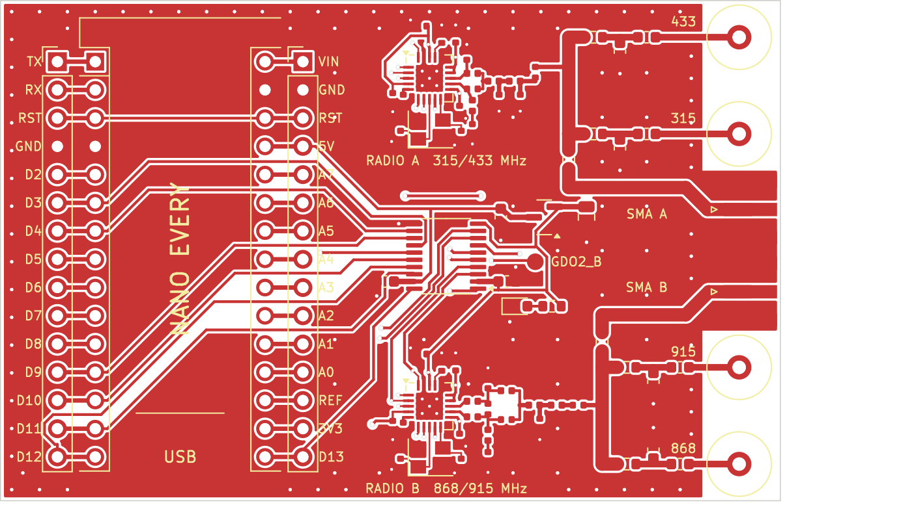
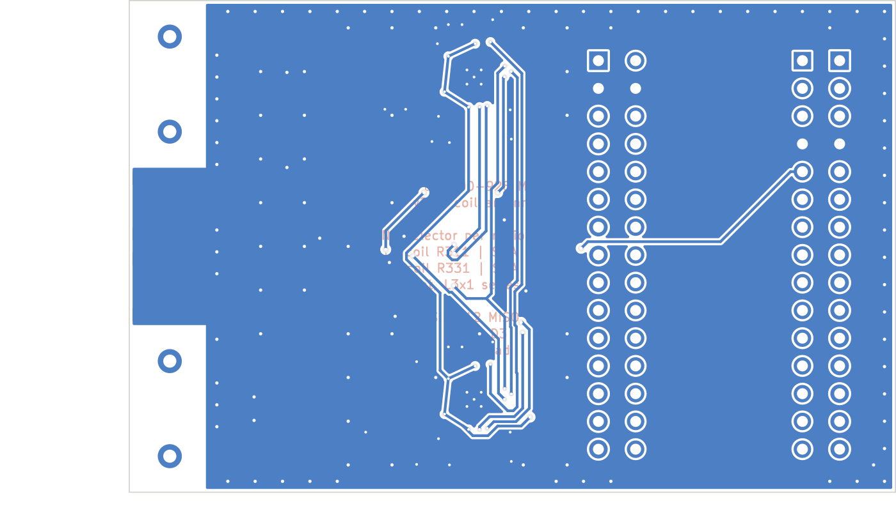

# nano-every-cc1101: Arduino Nano Every + 2x CC1101, coil antennas

A compact 70 x 45 mm **2-layer** carrier board for an Arduino Nano Every
with two TI CC1101 radios covering the CC1101's bands (300-348, 387-464
and 779-928 MHz). Each band has its own **coil (helical spring) antenna**,
the small upright kind used in handheld sub-GHz gadgets, so the board no
longer needs room for large printed antennas. All four coils are
JLCPCB-assembled; one 0 ohm selector per radio picks the band.
The Gerbers are generated and pass KiCad DRC with **0 violations, 0
unconnected pads**.

| Top | Bottom (viewed from below) |
|---|---|
|  |  |

## What's on it

| | |
|---|---|
| Board | 70 x 45 x 1.6 mm, 2 layers, FR4 |
| Radio A (U1) | CC1101, 315/433 MHz front end (433 fitted) |
| Radio B (U501) | CC1101, 868/915 MHz front end |
| Antennas | 4 coil antennas AE1-AE4 (433, 315, 868, 915 MHz), each with a T-match for retuning; optional SMA J1/J2 |
| Host | Arduino Nano Every in sockets, USB at the board edge, every pin re-broken-out on J3/J4 |
| Glue | TXS0108E 5 V <-> 3.3 V level shifter, XC6206 3.3 V LDO, power LED |

## Antennas

| Coil | Band | Radio | Part (BAT WIRELESS) | LCSC | Selected as shipped |
|---|---|---|---|---|---|
| AE1 | 433 MHz | A | BW433SNX21-5W2 (5 x 21 mm) | C496554 | **yes** (R301 0R) |
| AE2 | 315 MHz | A | BW315SNX39-6W3 (6 x 39 mm) | C496553 | fit R311, remove R301, + 315 MHz BOM |
| AE3 | 868 MHz | B | BW868SNX20-5Z6 (5 x 20 mm) | C496555 | **yes** (R321 0R) |
| AE4 | 915 MHz | B | BW915SNX17-5W2 (5 x 17 mm) | C496556 | fit R331, remove R321 |
| J1 / J2 | any | A / B | SMA edge jack, optional (hand-fit) | C496550 | fit R403 / R406 |

Each radio has a short 50 ohm bus; every antenna branch starts with its own
selector right at the bus (so unused branches are only a few mm of line),
then a shunt pad (C3x1) and a series part (L3x1, 0 ohm) at the coil for
retuning with a nanoVNA. The coils are pre-tuned by the maker for their
band; they are not simulated on this board. Frequencies between the coil
bands need a retune of that branch's T-match, or an external antenna on the
SMA jack (quarter-wave whip L = 71 250 / f mm).

The coils stand up from the board edge in a copper-free strip, 8.7 mm apart.
All four are fitted, so the unused coil next to the active one detunes it a
little (most for 868 vs 915, which are close in frequency): check with a
nanoVNA and trim the T-match if you need the last dB.

## Pins (Nano Every)

SPI shared: D13 SCK, D11 MOSI, D12 MISO. Radio A: CSn D10, GDO0 D2, GDO2 D3.
Radio B: CSn D9, GDO0 D4, GDO2 on test pad TP1 (3.3 V).
With RadioLib, e.g. `CC1101 radioA = new Module(10, 2, RADIOLIB_NC, 3);`
and `CC1101 radioB = new Module(9, 4, RADIOLIB_NC);`.

## Firmware

`firmware/dual_cc1101/dual_cc1101.ino` runs both radios at once with
RadioLib (receive on both by interrupt, send / retune from the serial
monitor). Compiled for the Nano Every (arduino:megaavr 1.8.8, RadioLib
7.7.1): **25.5 KB of 48 KB flash (51 %), 1.3 KB of 6 KB RAM (20 %)**, so
there is about 23 KB of flash and 4.8 KB of RAM left for your own code.

## Ordering (print ready)

1. PCB: upload `pcb/fab/nano_every_cc1101-gerbers.zip` (**not** the
   fab-package zip, which bundles the Gerber zip with the BOM/CPL and is
   for your records). 8 layers with Protel extensions (.GTL .GBL .GTS .GBS
   .GTP .GTO .GBO .GM1) + one plated drill file. 2 layers, 1.6 mm,
   70 x 45 mm, 1 oz. All standard rules (0.15 mm track/space, 0.25 mm
   minimum drill), no special options.
2. Assembly: `pcb/fab/bom-jlcpcb.csv` + `pcb/fab/cpl-jlcpcb.csv` (top side,
   fitted parts only, every line with an in-stock LCSC number, basic /
   preferred parts wherever the quality is the same). The four coils are
   through-hole parts, so choose an assembly option that includes
   through-hole soldering. Check the rotations of U1, U501, U2, U3, Y1 and
   Y501 in the preview.
3. By hand: Nano sockets (2x 1x15 female). Optional: SMA jacks J1/J2
   (LCSC C496550) and the J3/J4 breakout headers (LCSC C7501269).

## Files

| Path | What |
|---|---|
| `pcb/nano_every_cc1101.kicad_pcb` / `.kicad_pro` / `.kicad_dru` | The routed KiCad 7 board (+ the one custom DRC rule) |
| `pcb/gen_board.py` | Generates the whole board (placement, RF routing, autorouting, pours, silkscreen) |
| `pcb/lib/nano_every_cc1101.pretty` | Coil antenna and SMA footprints |
| `pcb/fab_outputs.py`, `pcb/make_fab.sh` | DRC, netlist, BOMs, CPL, Gerbers, renders |
| `pcb/fab/nano_every_cc1101-fab-package.zip` | Everything to order: Gerber zip + both BOMs + CPL |
| `pcb/fab/bom-no-nano.csv` | Purchasing BOM: every part except the Nano Every |
| `pcb/drc_report.txt` | KiCad DRC report |
| `firmware/dual_cc1101/` | Example sketch: both radios with RadioLib |
| `antenna/` | v1 printed-antenna study (openEMS), kept for reference |
| `bom.csv`, `netlist.md` | Generated from the board |
| `schematic_blocks.md`, `design_notes.md`, `assembly_instructions.md` | Design docs, bring-up |

## Limits

- Designed, not yet built or measured. Check each coil with a nanoVNA once
  built; the T-match pads are there to retune.
- A coil is narrowband (roughly its ISM band); other frequencies need a
  T-match retune or the SMA jack.
- 315 MHz needs radio A's 315 MHz front-end BOM swap (see
  `assembly_instructions.md`).
- No `.kicad_sch` schematic; the netlist is generated from the board.
- Not certified. Radiated use must follow your region's rules.
